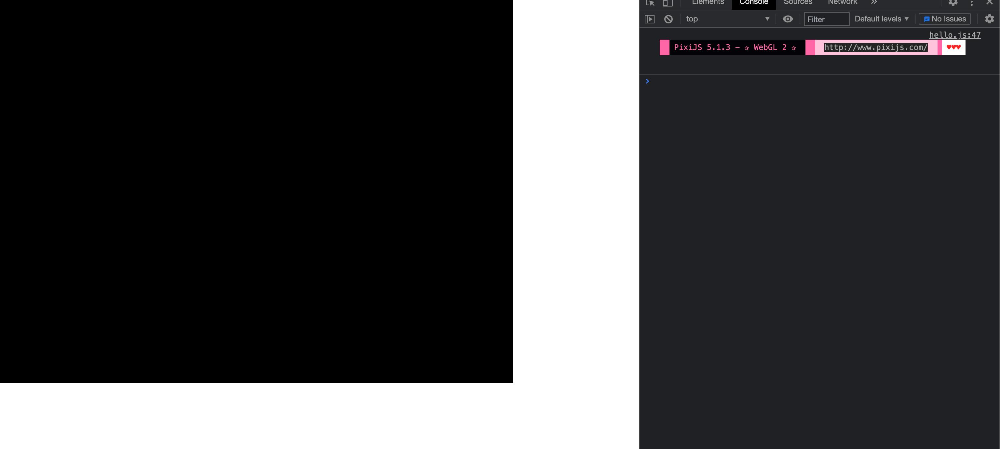
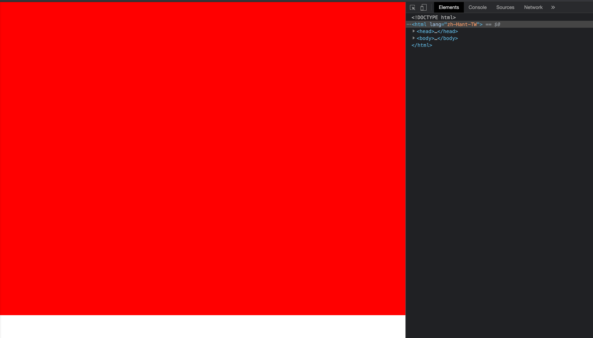
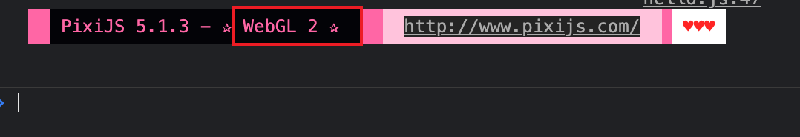
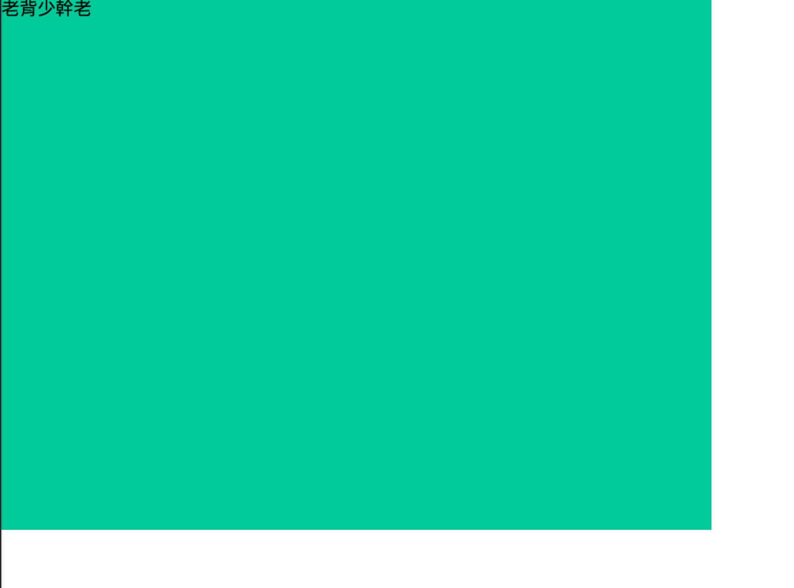
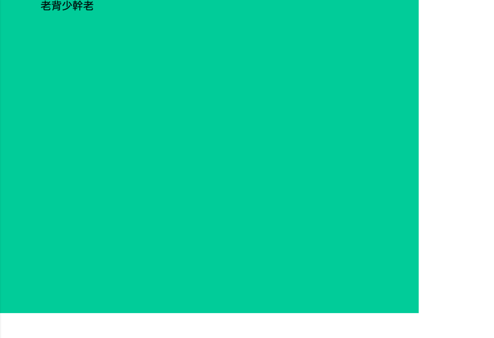
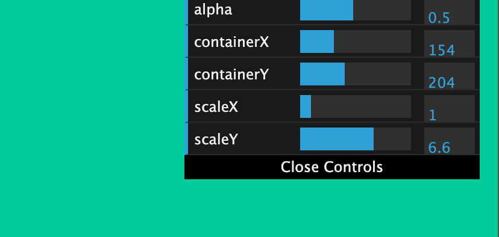
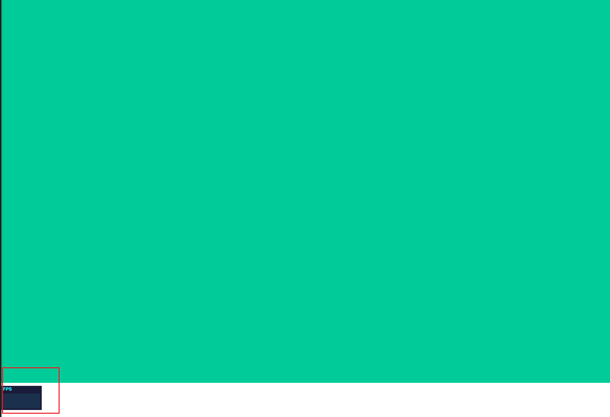
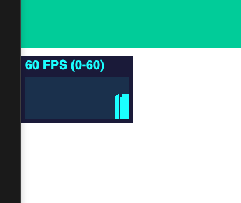

# PixiJS 練習

## Example1

## 先 new 一個 app

```js
const app = new PIXI.Application();

document.body.appendChild(app.view);
```

這樣就可以起最基本的環境了

##



這一塊黑色的本身就是 canvas

或者你也可以改為這樣寫，先創建一個 canvas，然後帶入參數到 `PIXI.Application` ：

```js
const app = new PIXI.Application({
  view: document.getElementById("main"),
});
```

```html
<body>
  <div id="container">
    <canvas id="main"></canvas>
  </div>
  <script src="https://cdnjs.cloudflare.com/ajax/libs/pixi.js/5.1.3/pixi.min.js"></script>
  <script src="js/app.js"></script>
</body>
```

有指定和沒指定的差異，在於我們新創 Canvas 本身是空的，而我們 new 出來的 `app` 預設背景是黑色，代表我們有把其塞入我們剛剛創建的 `canvas`

比較建議哪一種？

如果你的畫面，需要特定指定在一個絕對位置，就建議使用 `<canvas>` 賦予 `id`，指定位置

使用相對位置可能就比較不建議，因為它可能會隨著 HTML 元素變動而有其他狀況

另外可以看到我們創造出來的 `canvas` 本身大小是 `800 * 600`，這邊建議不要使用 css 做直接修改，我們可以帶入更多參數在初始化的時候：

```js
const app = new PIXI.Application({
  view: document.getElementById("main"), // 指定在某個 canvas 元素上
  width: 1024,
  height: 768,
});
```

另外有常玩遊戲的，也有反鋸齒的參數可以加入：

```js
const app = new PIXI.Application({
  view: document.getElementById("main"), // 指定在某個 canvas 元素上
  width: 1024,
  height: 768,
  antialias: true, // 反鋸齒
});
```

另外也有背景設置，比如說 `backgroundColor`，但是他使用的顏色格式和我們寫的 CSS 參數可能不太一樣：

```js
const app = new PIXI.Application({
  view: document.getElementById("main"), // 指定在某個 canvas 元素上
  width: 1024,
  height: 768,
  antialias: true, // 反鋸齒
  backgroundColor: 0xff0000, // 注意值，原則上就是前面補 0x 就好
});
```

可以看到背景變成紅色了：



再順便提一次，預設背景是黑色哦！

## WebGL

這邊先提一下 WebGL，它可以幫我們把網頁上的畫面，動畫交給顯示卡去渲染

PIXI 本身支援兩種模式，一種是原生 canvas 渲染，另一種就是 WebGL 渲染，這邊其實滿建議選擇 WebGL 做渲染，若你不要，我們可以再加上一個屬性：`forceCanvas: false` (預設就是 `false`，不用特別設定)

至於我們要怎麼看我們當下的 PIXI APP 是支援 canvas 還是 WebGL 呢？在 devtool console 就可以知道了



另外補充一下，如果要關掉 Console 的那些提示，可以在程式最初執行時，加入：

```js
PIXI.utils.skipHello();
```

這樣就可以了，有些產品類型的專案會考慮關掉

## 更方便的初始化

我們一開始寫 `new PIXI` 似乎有點繁雜，其實還可以用解構寫法：

```js
const { Appliction } = PIXI; // 解構

const app = new Application({
  view: document.getElementById("main"),
  width: 1024,
  height: 768,
  antialias: true,
});
```

## Example2

如同我們對基本 HTML 結構的了解，比如說 body 底下會有 div，h1，footer 等標籤，PIXI 其實也有類似的概念

- Stage -> body
- container -> Stage 底下的各個元素
- container -> container，可以繼續包裹

先有這個概念之後，我們就可以在原本創建的 `app` 裏面，再繼續創建 `container` 並將其塞入:

```js
const { Application, Container, Text } = PIXI; // 解構

const app = new Application({
  view: document.getElementById("main"), /
  width: 1024,
  height: 768,
  antialias: true,
});

const container = new Container();

app.stage.appChild(container);
```

當然，在畫面上時不會變的，因為 `Container` 裡面我們沒有帶什麼參數，這時候我們可以繼續創建一些文字 (因為預設文字也是黑色，所以加個背景色)：

```js
const { Application, Container, Text } = PIXI; // 解構

const app = new Application({
  view: document.getElementById("main"),
  width: 1024,
  height: 768,
  antialias: true,
  backgroundColor: 0x00cc99, // 加個背景色吧
});

const container = new Container();

app.stage.addChild(container);

const text = new Text("老背少幹老");

container.addChild(text);
```



## 開始移動

現在 container 裡面包著一個 text，我們現在如果要讓這段話移動，就可以選擇讓 `container` 作動。

這邊要移動也很簡單，這邊 PIXI 的 API 提供 X 軸與 Y 軸，所以我們可以：

```js
container.x = 100;
```



可以看到老背少幹老往右移動了 100 了，單位應該是 px

## 畫面滿版

只要在初始化時指定寬為 `window.innerWidth` 即可

## 鍵盤事件

因為遊戲大多會使用到鍵盤來玩，所以就需要做一些畫面監聽，來做事件監聽鍵盤觸發，我們掛在 `body`

```js
const body = document.querySelector("body");

body.addEventListener("keydown", (evt) => {
  console.log(evt.key);
});
```

由於 `evt.keyCode` 已經被淘汰，所以這邊不使用 `keyCode`，使用 `key`：

```js
body.addEventListener("keydown", (evt) => {
  // console.log(evt.key);
  move(evt.key);
});

// event helper:
function move(key) {
  const arrows = {
    ArrowUp: () => (container.y -= 20),
    ArrowLeft: () => (container.x -= 20),
    ArrowDown: () => (container.y += 20),
    ArrowRight: () => (container.x += 20),
  };

  arrows[key]();
}
```

如此，按下方向鍵之後，老背少幹老就會移動了

## Example 3

目前台灣遊戲以什麼框架製作比較多？

Phaser，但是他的基底是用 PIXI 來做，就有點類似 Next 之於 React 的概念

## PIXI - 遊戲循環

讓我們接著製作吧，現在加入一個滑鼠監聽！

什麼是遊戲循環？

我們剛剛在畫面上，假設我現在使用監聽滑鼠位置，改變 `container` 的座標，這時候我們就需要做畫面重新渲染：

```js
el.addEventListener("mousemove", (evt) => {
  app.ticker.add(() => {
    container.x = evt.clientX;
    container.y = evt.clientY;
  });
});
```

我們現在解釋一下幾個語法：

### `container.interactive`

讓使用者可以與 `container` 互動，非常重要的一個 method，預設為 `false`

```js
container.interactive = true;
```

### `container.buttonMode`

預設為 `false`，如果要掛事件監聽，要改成 `true`，滑鼠移動上去之後會有 `pointer` 樣式。

```js
container.buttonMode = true;
```

## GUI 工具

我們現在在 `index.html` 引入一個新套件：

```html
<script src="https://cdn.bootcdn.net/ajax/libs/dat-gui/0.7.7/dat.gui.min.js"></script>
```

這是一個 GUI 工具，不是 PIXI 專屬

引入之後，我們 new 一個實體，並執行相關 method:

```js
/**
 * Dat GUI
 */

const datGuiData = function () {
  this.alpha = 1;
  this.containerX = 0;
  this.containerY = 0;
  this.scaleX = 1;
  this.scaleY = 1;
};

const datGuiTools = new datGuiData();
const gui = new dat.GUI();
gui.add(datGuiTools, "alpha", 0, 1);
gui.add(datGuiTools, "containerX", 0, 512);
gui.add(datGuiTools, "containerY", 0, 512);
gui.add(datGuiTools, "scaleX", 0, 10);
gui.add(datGuiTools, "scaleY", 0, 10);
```

`this` 後面是哪些屬性，`gui.add` 二個參數就要帶哪些屬性，第三個和第四個參數則是範圍

這樣就掛載好了我們的 DatGUI Tool 了，我們可以再畫面上看到 Controls:



設定好之後，我們還得將其與 `container` 串接在一起，讓我們在控制面板調整數值時，這些數值會與 `container` 掛鉤：

```js
app.ticker.add(() => {
  container.x = datGuiTools.containerX;
  container.y = datGuiTools.containerY;
  container.scale.x = datGuiTools.scaleX;
  container.scale.y = datGuiTools.scaleY;
});
```

這個工具可以幫助我們尋找定位點，這邊就不上圖了，但嘗試之後你會發現當你調整 Controls 的數值時，`container` 會跟著移動，如此我們就可以馬上知道當一個物件移動時，他當下的定位點會是多少，幫助我們順利開發。

## Example4

首先，引入 [Stats.js](https://github.com/mrdoob/stats.js/)

```html
<script src="https://cdnjs.cloudflare.com/ajax/libs/stats.js/r16/Stats.min.js"></script>
```

## FPS

也就是所謂的「幀數」，一般來說預設是 60FPS，也就是每秒刷新 60 次，當次數達到這麼高的時候，由於人體視覺暫留的原因，所以會更有動畫感。

FPS 如果過高，畫面則會有撕裂的感覺，如果過低，就會有一張一張翻頁的錯覺，兩種都不好。

## 使用 stats

我們一樣 new 一個實體出來，並將其渲染在我們的畫面上：

```js
const stats = new Stats();

stats.showPanel(0);
document.body.appendChild(stats.domElement);
```

可以看到出現了 FPS 的數據面板：



接著繼續：

```js
function animate() {
  stats.begin();
  stats.end();
  requestAnimationFrame(animate);
}

requestAnimationFrame(animate);
```

關於 `requestAnimationFrame`，可以參考：https://ithelp.ithome.com.tw/articles/10186735，基本上是一個不斷重複呼叫自己的 method，達到動畫的效果，以此來測試我們的 stats 的運作

現在畫面不斷更新，所以 FPS 也有了變動：



如果想調整 Panel 的位置，可以使用以下方法調整：

```js
stats.domElement.style.position = "absolute";
stats.domElement.style.top = "0";
stats.domElement.style.left = "0";
```

目前不確定是不是都要這麼麻煩，不過先記住這個方法。


